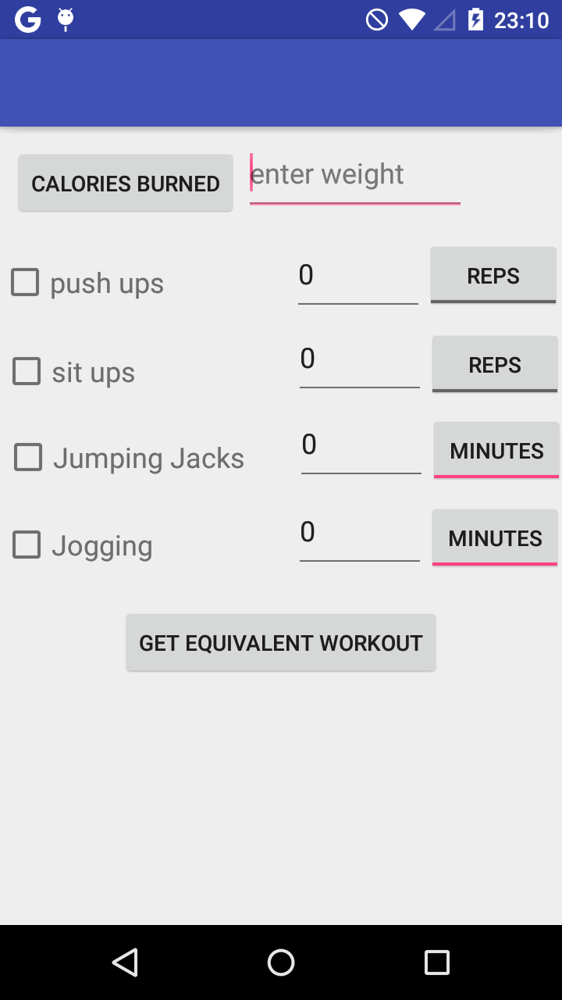
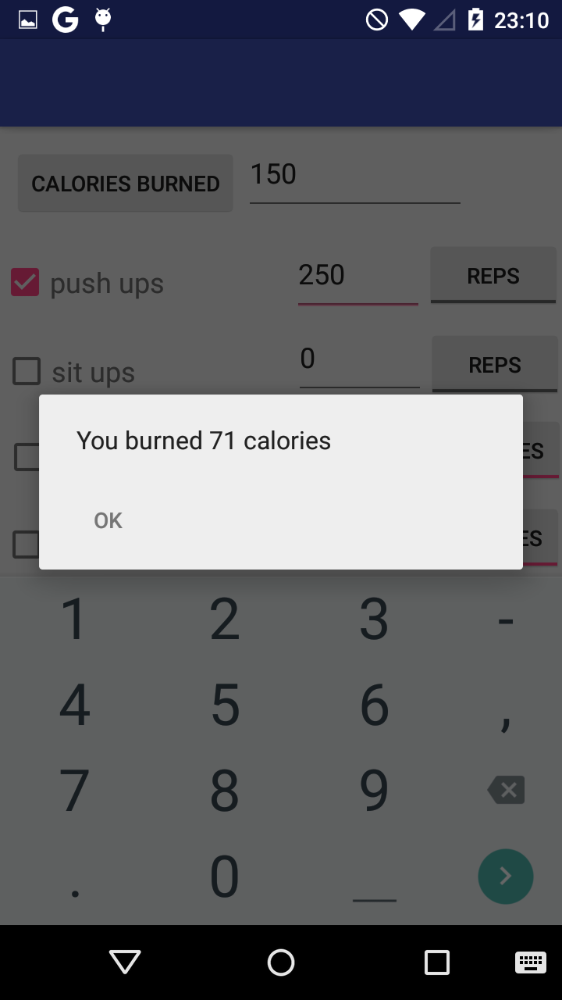
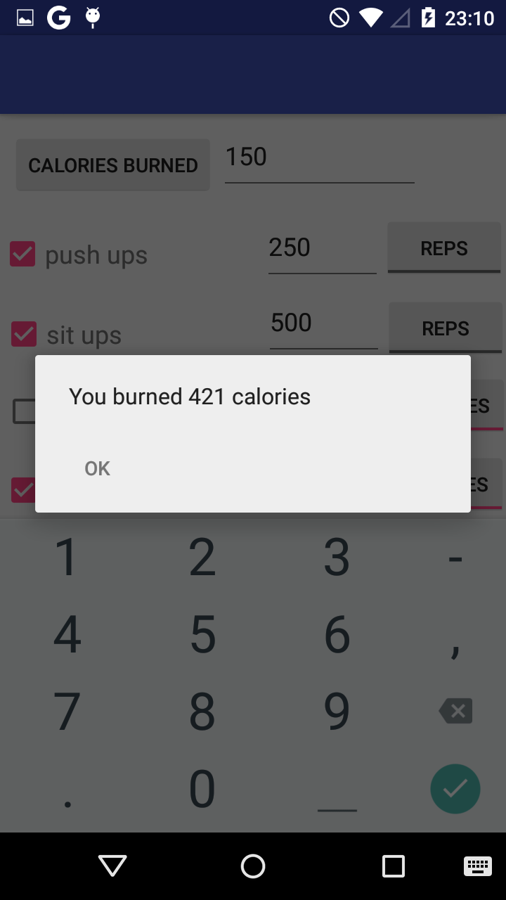
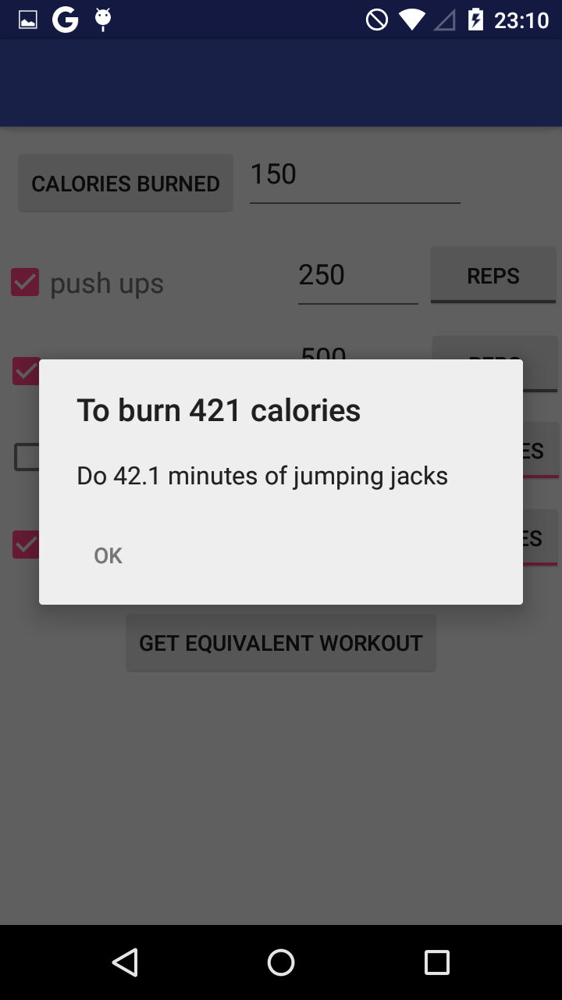

#PROG 01: Crunch Time

Calculate how many calories you burned from your workout! Also, bored of your workout routine? Find alternative workouts that burns the same amount of calories!

## Authors

Albert Jo ([namhyun@berkeley.edu](mailto:your_email@berkeley.edu))

## Demo Video

See [your demo video title here] (https://www.youtube.com/watch?v=3u0DjMPyVaE)

## Screenshots

## Acknowledgments

* Hat tip to anyone who's code was used
* Any other support

*Feel free to enhance your README. For Markdown syntax, see [the GitHub Guides](https://guides.github.com/features/mastering-markdown/). Remove this line in your submission.*
